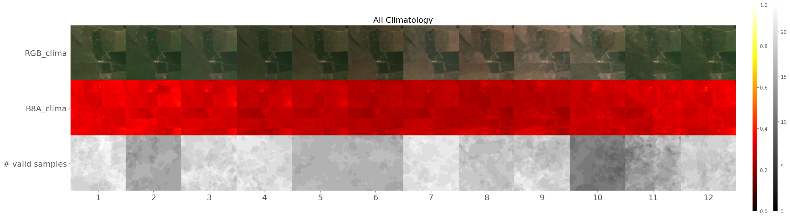
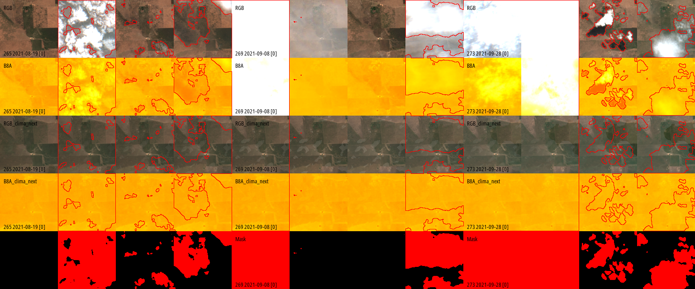
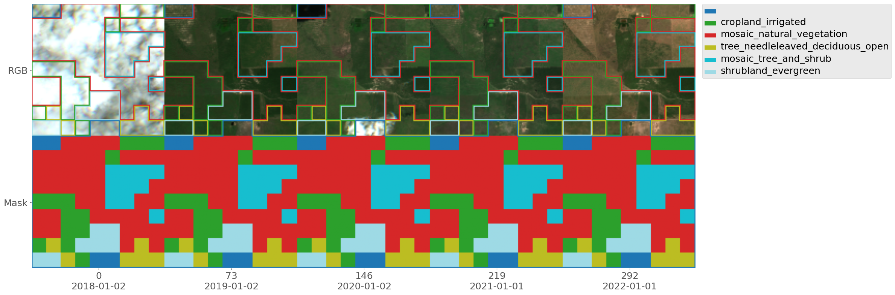

# txyXAI

Visualiation for spatio-temporal data with matplotlib and numpy / cv2 backends

## Overview

Custom visualization of highly-dimensional data (specially multichannel spatio-temporal). Here are some example plots:

We can have an arbitrary number of color bars (for different channels), that have esily customizable `limits`, that can be `center`ed around zero or not, and with custom `cmaps`, allowing for the easy visualization of several image modalities / bands / channels. If images are have three channels (they either have 1 or 3), then they are assumed to be RGB. The example below uses two different color bars:


If you ever got the Matplitlib error: `ValueError: Image size of NxM pixels is too large. It must be less than 2^16 in each direction`, then you know that Matplotib cannot plot bigger images. For those cases, there is the `numpy backend` which uses no Matplotlib to build the image, and returns an RGB image array for direct plotting, saving, or sending to TensorBoard. The example below uses the `numpy backend`:


Finally, the library supports plotting masks with an arbitrary number of classes (int-encoded), either on top of the image, or as an independent image at the bottom, or both at the same time. In this example we are plotting the mask both on top of the data as well as at the bottom for clarity:


This is one last example of a very big image where `stack_every` was set to 73, so that rows are stacked vertically every approximately one year of data, allowing to better see inter-year changes to vegetation:


Here are some notable functions in this library:

## Installation

Installation requires `scipy, numpy, matplotlib`

```{Bash}
pip install git+https://github.com/OscarPellicer/txyvis.git
```

## Usage

```{Python}
from txyvis import plot_maps
plot_maps(...)
```

## Main functions

### `plot_maps` function signature:

Plots highly dimensional image-like data alongside masks, etc. Supports matplotlib as well as direct generation of images without matplotib.

```{Python}
def plot_maps(
    images:list, #Image with shape (t, {1,3}, h, w) 
    cmaps:Optional[list]=None, #List of mpl cmaps. E.g: ['PiYG', 'hot']
    centers:Optional[list]=None, #List of bools defining whether to force the colorbar to be centered
    limits:Optional[list]=None, #List of tuples of two floats, defining the limits of the colorbar
    title:Optional[str]=None, #Title of the plot
    masks:Optional[list]=None, #List of masks with shape (t, 1, h, w) 
    figsize:Union[tuple, float]=1., #Tuple of two ints or float (scale of the auto figsize)
    xlabels:Optional[list]=None, #List of x labels
    ylabels:Optional[list]=None, #List of y labels
    classes:Optional[dict]=None, #Legend of the classes in masks
    colorbar_position='vertical', #One of ['horizontal', 'vertical']
    mask_kwargs:dict={}, #Args to pass to `add_mask`, such as `colors`
    cmap_kwargs:dict=dict(  #Args to pass to `nan_color` and `inf_color`
      nan_color='cyan', #Color nan pixels 
      inf_color='orangered', #Color inf pixels 
      zero_color='magenta'), #Color for allzero images
    upscale_factor:int=1, #Upscale image and mask to reduce border width
    show:bool=True,
    backend:str='matplotlib', #If backend is numpy, create image only through array manipulation
    numpy_backend_kwargs:dict={'size':12, 'color':'black', 
                             'xstep':1, 'ystep':1, #Plot labels every n steps
                             'labels':'edges', #Plot either on 'edges' or full 'grid'
                             'font':'OpenSans_Condensed-Regular.ttf'},
    plot_mask_channel=None, #Plot the mask corresponding to image at position plot_mask_channel
    matplotlib_backend_kwargs:dict={'text_size':None},
    transpose:bool=False, #If true, time is set along the y axis (by default, it is along the x-xis)
    stack_every:Union[int,bool]= False #If True, stack the image vertically every `stack_every` images
 ):
    ''' 
    Images must have shape (t, {1,3}, h, w) 
    If image is already rgb, the parameters associated to that image except `limits` will be ignored
    If `backend == `matplotlib`, returns (fig, axes)
    If `backend == `numpy`, returns image array
    '''
```

### `add_mask` function signature:

Embeds a mask into an image either by blending mask color and image color, or by painting only the border of the mask over the image.

```{Python}
def add_mask(img:np.ndarray, mask:np.ndarray, colors:dict={0:None, 1:'r'}, 
             mode:Union[str,float]='border'):
    '''
    Superimpose a `mask` over an image `img` using some blending `mode` and
    specific `colors` for every class in `mask`. It expects:
        - mask: (w,h,1)
        - image: (w,h,3)
    '''
```